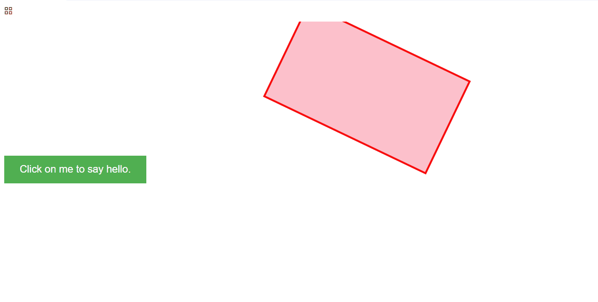

  
# 前端学习日记

## 当前进度
- [x] HTML基础  
- [x] CSS盒子模型  
- [ ] JavaScript交互
- [x] 实现悬停变色效果  
- [x] 添加交互按钮  

## 实验目录
| 章节       | 代码链接                   | 学了什么               |
|------------|---------------------------|----------------------|
| 盒子模型   | [代码](box-model/)        | 宽高/边距/边框       |
| 交互功能   | [代码](box-model/)        | 悬停效果/按钮点击     |  
| 动画效果   | [代码](box-model/) | 无限旋转/关键帧动画 |  
| 表单验证   | [代码](box-model/) | 密码强度检测/加载动画 |  
## 项目截图  
  
## 🎥 动画演示  
  
## 🤝 参与贡献  
欢迎提交Pull Request！请先阅读 [贡献指南](CONTRIBUTING.md)  
